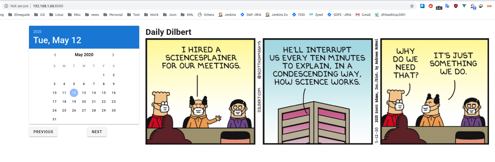

# dailydilbertvue
## Description
This is a demonstration on how avoid problem with CORS in a vue app. The app will get the daily dilbert comix using a calendar.
This is not my idea - I just wanted to show that this can be used in a small application, what do something that sort of make sense.
There is some good description i (https://www.codecademy.com/articles/what-is-cors) and the way to set up a proxy is taken from (https://medium.com/js-dojo/how-to-deal-with-cors-error-on-vue-cli-3-d78c024ce8d3)

## Screendump
 

## Project setup
```
npm install
```

### Compiles and hot-reloads for development
```
npm run serve
```

### Lints and fixes files
```
npm run lint
```

### Customize configuration

See [Configuration Reference](https://cli.vuejs.org/config/).
Note, that there is this extra vue.config.js added 
